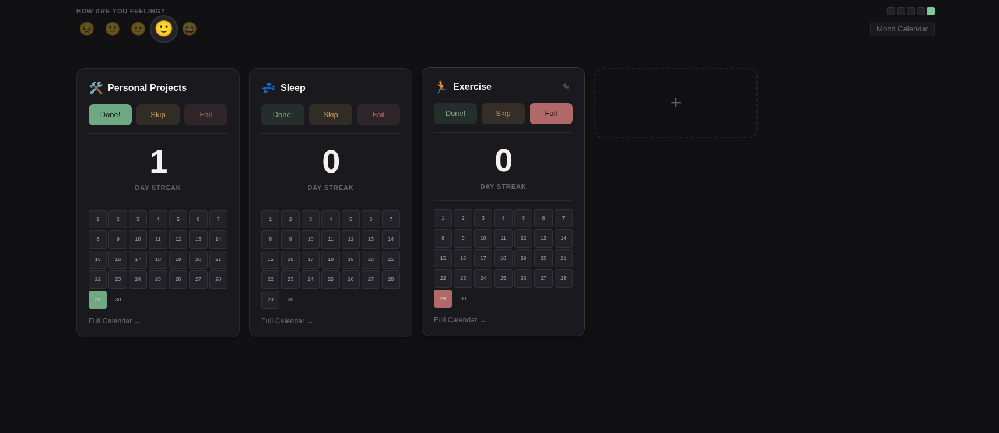

# Habit Tracker

A self-hosted habit streak tracker with daily mood logging. Built to run on a home server and accessed from anywhere over a private network.



## Features

- **Habit tracking** — up to 5 habits, each with a custom emoji. Mark each day as done, skipped, or failed.
- **Streak counter** — animated odometer counts consecutive passing days.
- **Mini calendar** — click any day in the current month to cycle its status. Grace window: today and yesterday are editable; older days are locked.
- **Full year calendar** — Jan–Dec view per habit with color-coded status cells and a completion bar.
- **Daily mood** — 5-point emoji scale with a last-5-days color strip and a full mood calendar (3-month or full-year view).
- **Morning check-in modal** — dedicated `/checkin` route opens a focused view for logging yesterday's habits and mood.
- **Push notifications** — daily reminders via [ntfy.sh](https://ntfy.sh) (no account required). 8am links directly to the check-in modal.
- **Drag to reorder** — rearrange habit cards on desktop by dragging.
- **Mobile-first** — swipe between habit cards on mobile; tap to log.
- **Grace window locking** — pending entries older than yesterday are automatically marked fail at midnight.

## Tech stack

| Layer | Choice |
|---|---|
| Backend | Node.js + Express |
| Database | SQLite via `better-sqlite3` |
| Frontend | React + Vite |
| Notifications | ntfy.sh (topic-based push) |
| Scheduling | `node-cron` (no system cron needed) |
| Tests | Vitest + Supertest + Testing Library |

## Quick start

```sh
git clone <repo>
cd HabitTracker
npm install
npm run build
npm start
```

The app runs on port 3000 by default. For local development with hot reload:

```sh
npm run dev        # starts the Express server with --watch
npx vite           # in a second terminal — Vite dev server on :5173
```

## Environment variables

| Variable | Default | Description |
|---|---|---|
| `PORT` | `3000` | Server port |
| `DB_PATH` | `./habits.db` | Path to the SQLite database file |
| `APP_URL` | `http://localhost:3000` | Base URL included in notifications |
| `NTFY_URL` | *(unset)* | ntfy.sh topic URL, e.g. `https://ntfy.sh/your-private-topic`. If unset, notifications are skipped. |

`VITE_BASE_PATH` (build-time only) sets the app's URL prefix if serving under a subpath (e.g. `/habittracker/`). Defaults to `/habittracker/`. Create a `.env.local` file with `VITE_BASE_PATH=/` for local development.

## Deployment

Build the frontend, then run the server as a persistent service (systemd, PM2, etc.). A reverse proxy (Nginx, Caddy) can serve the app under a subpath alongside other projects on the same host.

The SQLite file (set via `DB_PATH`) is the only thing that needs to be backed up.

## Notifications

Three scheduled jobs run daily:

| Time | Action |
|---|---|
| Midnight | Locks pending entries outside the grace window (→ fail) |
| 8:00 am | Sends yesterday's habit statuses with a link to the check-in modal |
| 9:00 pm | Sends today's current status as an evening reminder |

ntfy.sh topics are public by obscurity — use a long, random topic name.
